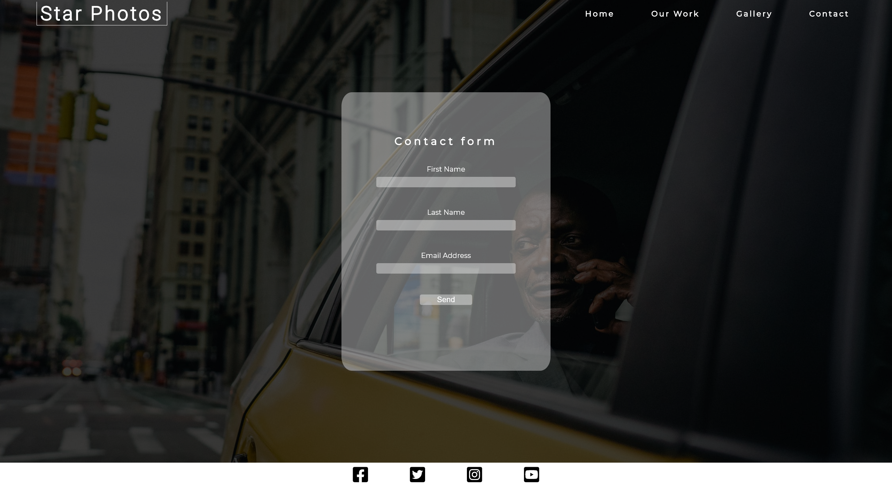

# Star Photos photo & video agency

## The purpose of this site:

- To provide users with photography services directed at suburban, nature or wedding photos.

## Site structure:

### Main page

The main page consists of a header with a logo and navbar, a section of photography categories (wedding, nature and city), a short section presenting some of the work
the agency does and a footer. The categories on the top of the page makes it easy for the user to get directly to the gallery section where the real magic happens.

The photos on the main page are not clickable, meaning they do not open in a new tab, but is instead intended to give a short introduction only.

On the bottom of the page there are three videos that correspond to the photography categories.

### Gallery page

The gallery page consists of three separate galleries that were made using css grid. They are clickable and will open in a new tab when clicked.
They present some of the best work the agency has done and showcases the skills that the user is looking for.

### Contact page

The user can input their information to get in touch with the agency.
The contact form is static only, meaning clicking "submit" takes you back to the home page and doesn't actually send the information given anywhere.

## Deployment procedure

The first step of the procedure is to come up with a design that is easy on the eyes and simple to understand.

Once the design is roughly done the steps taken were:

1. Creating a navbar that is easy and fairly simple to use even on smaller screens.

   - The navbar is built using flexbox.
   - It scales with the site when increasing/decreasing in size.

2. Creating the hero backgound image.

3. Creating the main and gallery page using css grid for photos.

4. Creating the contact form.

When each part of the site (i.e header, footer, main page etc) had been tweaked and/or fully created, I staged it to be pushed to github using the Git version control system.

The final step is pushing the finished product to github.
